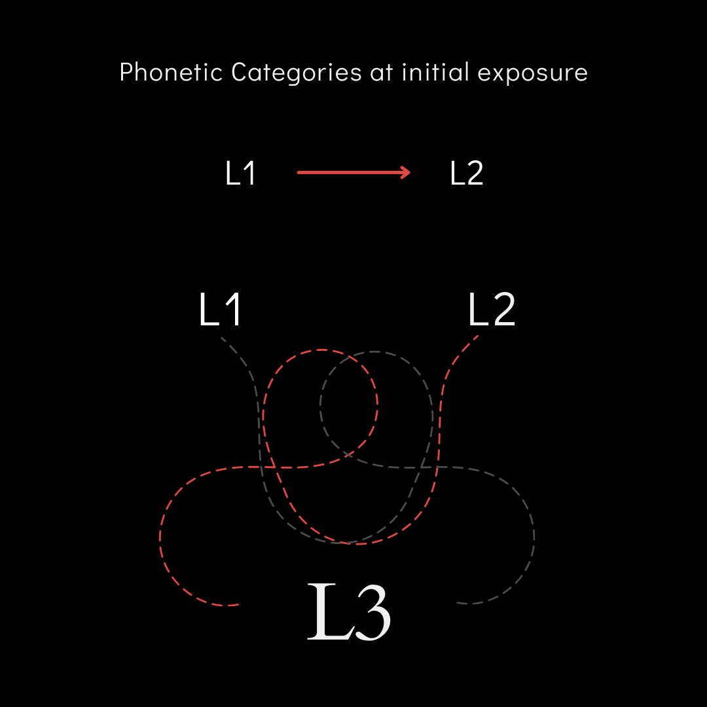
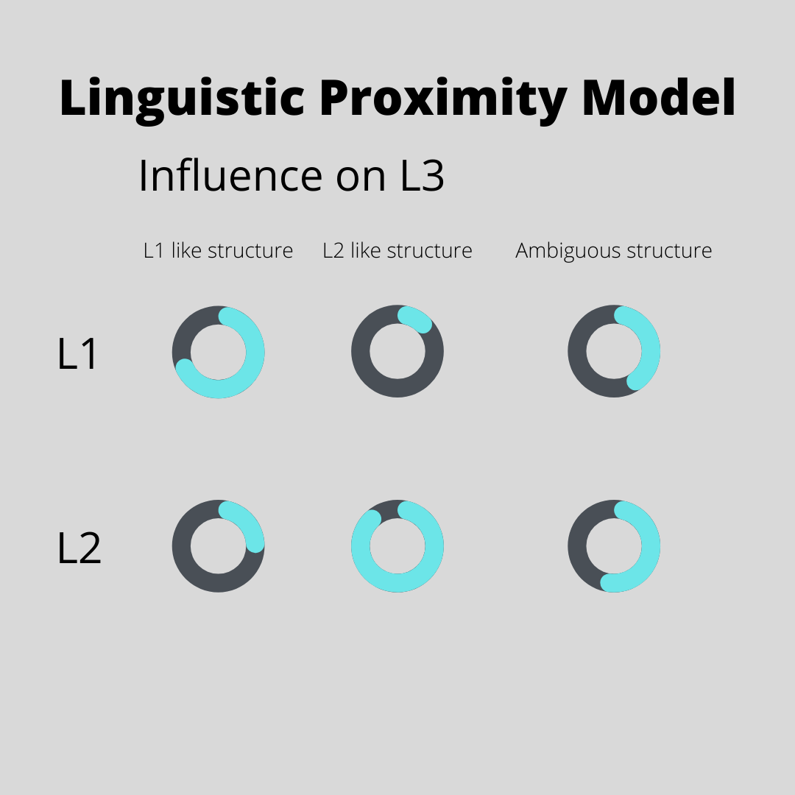
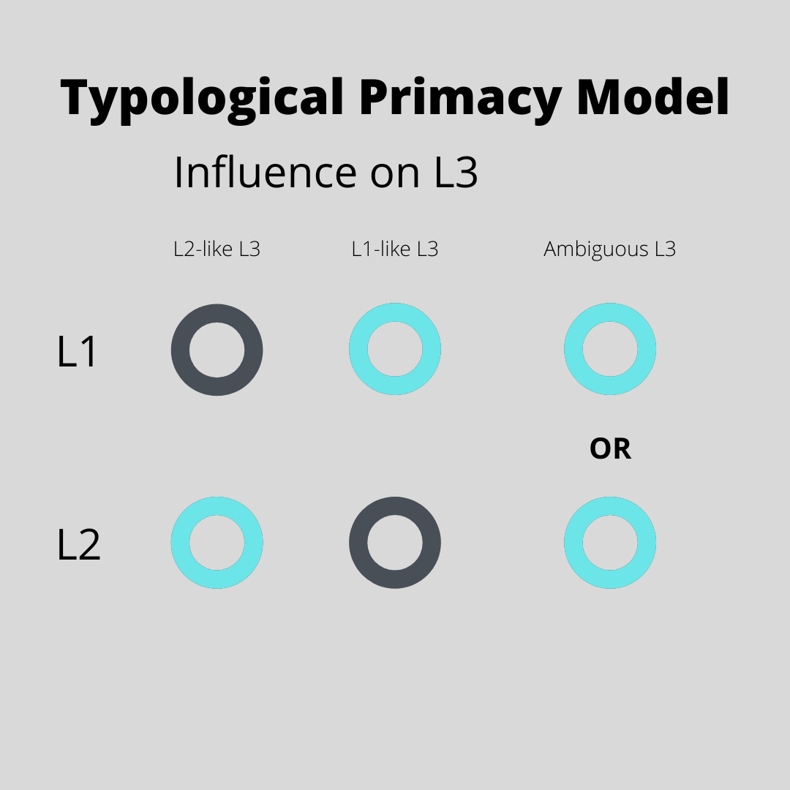
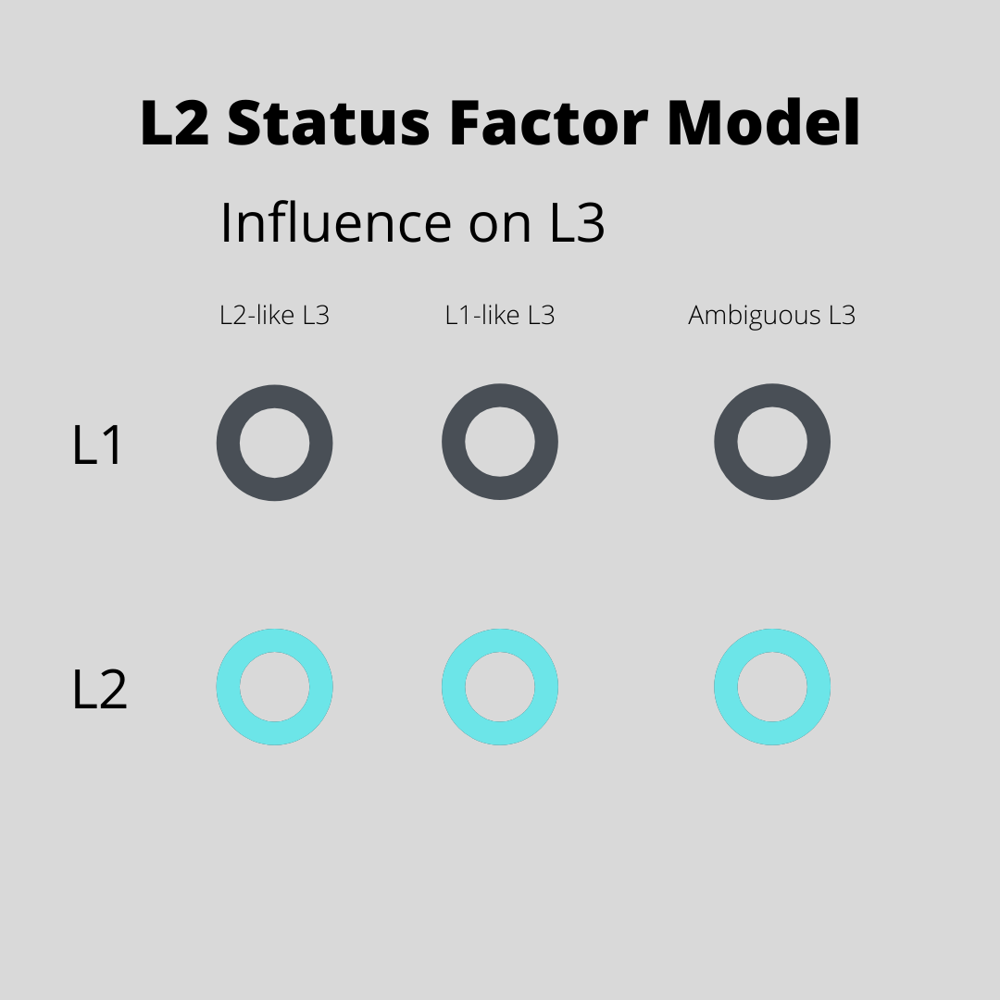
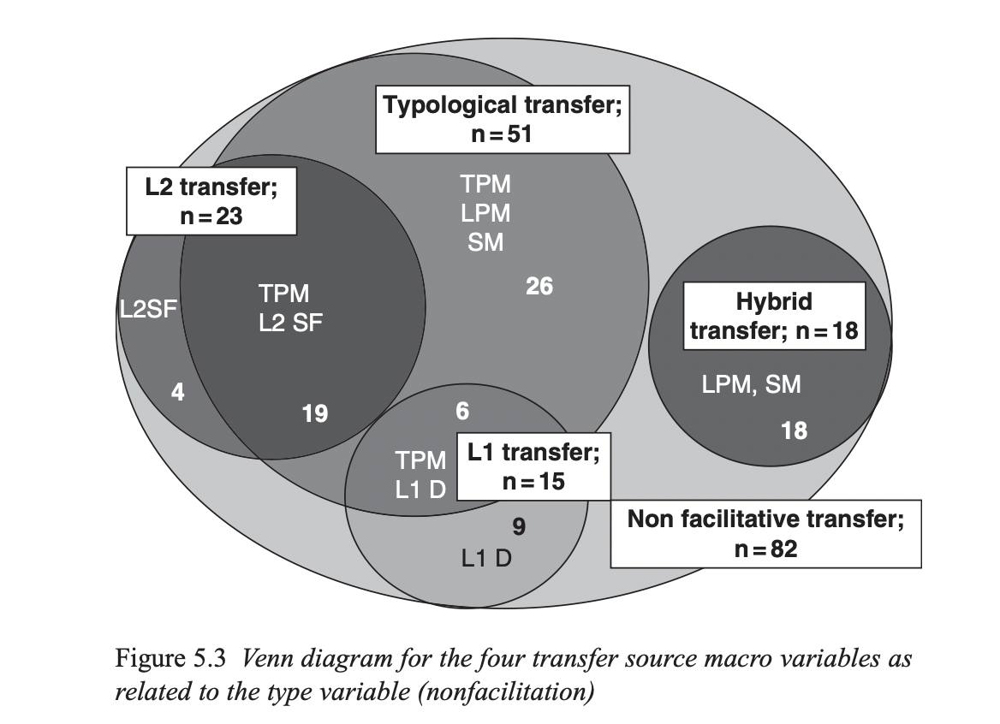

```{r, include = FALSE}
library(here)
library(tidyverse)
```

```{r, setup, include=FALSE}
knitr::opts_chunk$set(
  comment = '', fig.width = 6, fig.height = 6, message = FALSE, warning = FALSE, echo = FALSE
)
```

.pull-left[
.big[
**Overview**

- Introduction

- Background

- The Present Dissertation

- Conclusion 
]
]

.pull-right[
```{r, echo=F}

```
]


???


To get started, this proposal will cover 4 major sections. First, I'll briefly introduce L3 acquisition, then I'll discuss the background literature. 
Next, I'll talk about how the present dissertation contributes to the field, and finally I will wrap up with a conclusion and open for questions and comments. 

---

# Introduction 

.pull-left[
- L2 learning is difficult.
  - L2 phonetic target-likeness is difficult for adults.
  - L2 initial state is limited by **L1 phonetic categories.** 

- Less is known about L3 phonology.
  - In L3 learning, **L1 and L2 phonetic cateogories exist at initial exposure.**
]

.pull-right[
```{r, echo=F}

```
]

.footnote[
(Flege et al., 2021)
]

???

It is well documented that L2 learners have a difficult time achieving native-like mastery of a second language when it comes to phonetics and phonology, differently from L2 syntax or general L2 knowledge.
This difficultly is thought to occur, in part, because L2 phonetic learning is initially constrained by L1 phonetic categories. 
Much less is known about L3 phonetic learning, where L1 and L2 phonetic categories exist and may influence the newly learned language.

Traditionally, it was assumed that L3 learning was simply another instance of L2 learning. 
Recent research, however, has suggested that this is not the case, since both a first an second language seem to impact L3 learning. 

---

class: title-slide-section, middle

# Background: L3 Models 

???

In recent years, several models of third language acquisition have been proposed.
A principal aim of these models is to predict how a first and second language impact L3 acquisition.
For instance, it is debated whether whole language influence occurs, thereby blocking access to another language, or property by property influence occurs. 

---

# The Linguistic Proximity Model 

.pull-left[
.full-width[
.content-box-green[
.large[
- L3 learning is **co-activation** of L1 and L2

- Structure-by-structure influence

- Driven by underlying structural similarity
]
]
]
]

.pull-right[
```{r, echo=F}

```
]

.footnote[
(Westergaard et al., 2017)
]

???
One such model, which frames the present dissertation, is the Linguistic Proximity Model. 
Following the idea that all languages known by a bilingual are always active, this model sees L3 learning as co-activation of the L1 and the L2.
A visualization of the models predictions can be seen on the figure on the right.
The circles represent the relative activation of the L1 and the L2, where the blue portion of the circle represents the relative activation of the each language during L3 processing in three cases.
In the case of an L1-like structure, it is predicted that, although both languages are active, the L1 will be likely be reasonably more activated than the L2.
The same case can be seen when the L3 contains an L2-like structure, where the L2 displays more relative activation that the L1. 
In the case of an ambiguous structure, however, L1 and L2 activation levels would be predicted to be closer to even. 

So, this model posits that each L3 structure has what is referred to as full transfer potential from the L1 or the L2, where anything from either language is accessible to the L3 learner. 
and, this FTP is thought to be modulated by underlying structural similarity between languages. 
 
Concretely, the model predicts that in an experiment, L3 performance on a task should fall between L1 and L2 performance, and that this would serve as evidence of co-activation of the L1 and L2. 
For example, judgment task data would see the percentage of acceptances/rejections that falls between L1 and L2 values. 
If L3 judgments fell outside L1 and L2 values, this would falsify the predictions of the model. 

---

# The Typological Primacy Model

.pull-left[
.full-width[
.content-box-blue[
.large[
- **Only** L1 or L2 (closer typological language) influences the L3

- Wholesale transfer during the "initial stages"

- Language choice is determined by parsing L3 input during learning

]
]
]
]

.pull-right[
```{r, echo=F}

```
]

.footnote[
(Rothman, 2011, 2013, 2015)
]

???

Other models suggest that just one language influences the L3, such as Rothman's Typological Primacy Model, or the TPM.
As the visual in this slide suggests, the TPM suggests that ONLY the L1 or the L2 is transferred to the L3 in one fell-swoop during what is referred to as the "initial stages" of L3A based on global typological similarity.
So, if an  L3 is determined to be closer to the L2... or the L1... the model makes rather straight forward predictions. 
For example, if a Spanish-English bilingual learns L3 Portuguese, the typological similarity between Spanish and Porutguese is predicted to be evident to the learner. 
In this case, even though Spanish knowledge is largely helpful to a learner of BP, the TPM argues that the unhelpful portions of Spanish also influence L3 BP, even when English would be a better choice. 

Additionally, the term "initial stages" that the TPM uses refers some 20-25 hours of L3 instruction. 
As a result, the full transfer of one language system is not argued to occur until this time. Before the full language transfer, the TPM suggests that access to both languages is possible. 


---

# The L2 Status Factor 

.pull-left[
.full-width[
.content-box-red[
.large[
- The **L2 influences L3**

- Late learned languages are cognitively similar

- L1 access is possible with metalinguistic knowledge
]
]
]
]

.pull-right[
```{r, echo=F}

```
]

.footnote[
(Bardel and Falk, 2012)
]


???

An additional model of L3A is referred to as the L2 Status Factor. 
This model, proposed before the TPM and LPM, suggests that the L2 is the default source of influence in L3 and blocks access to the L1.  
This prediction is derived from a proposed cognitive similarity between late-learned languages under the declarative-procedural model.
In this view, second and third languages are both subserved by declarative memory and the L1 is procedural.
Importantly, this view also suggests that L1 access if possible when the L3 learner is metalinguistically aware. 

---

class: title-slide-section, middle

# Background: Evidence

???

Each of these models has been tested empirically and has received some support.
Briefly, I'll start with an overview of the relevant research done in morphosyntax, and then discuss what has been done in L3 phonology.


---
# Background: Evidence

.big[
.pull-left[
- There is evidence for all views. 
  - Mostly carried out in L3 morphosyntax.

- These studies examine how **L1** and/or **L2** influence the **L3**
]]

--

.big[
.pull-right[
- Systematic review (Rothman et al., 2019) of **92** empirical studies 

- Coded for: 

  *L2 influence*
  
  *Typological influence*
  
  *L1 influence*
  
  *Hybrid influence*
]]


???

As I just mentioned, these models were originally proposed in morphosyntax, and the studies for each model has mostly been investigated in this domain. 
Recently, a systematic review was carried out by Rothman and colleagues to evaluate the predictions of each model.
In particular, the authors coded 92 studies done in the acquisition of L3 morphosyntax and coded them as having L2 influence, typological influence, L1 influence, or hybrid influence.  

---

```{r, echo=F}

```

???

The results suggested that the majority of studies were explained by typological similarity, followed by L2 transfer, then hybrid transfer, and finally L1 transfer.
A few notes here: First, the graphic here from Rothman et al. (2019) shows only 82 studies because the authors left out 10 studies that reported only faciltative transfer; non-facilitative or unhelpful transfer from a source language is argued to be crucial evidence to the TPM, so the authors chose to leave these studies out.
Second, many of these studies were coded as providing evidence for more than one view.
For example, 19 studies reported L2 influence, but were also coded as typological trasnfer. 
Unfortunately, it's not clear what the criteria was for determining when L2 transfer was also typological transfer and when it was not.
The same potential issue can also be applied to L1 influence.
Although the coding criteria here was not always clear, it does seem that there is evidence for each view in the domain of morphosyntax. 

---

# L3 phonology 

.pull-left[
.full-width[
.content-box-red[
**Production**

- L3 production results have been mixed
 - **L2 status** (Wrembel, 2010; Llama et al., 2010)
 - **L1 effect** (Wrembel, 2014)
 - **Intermediate values** (Wrembel, 2015; Llama & Cardoso, 2018)
 
- No clear explanation for mixed findings. 
]]]

--

.pull-right[
.full-width[
.content-box-red[
**Perception** 
 
- Little research in L3 perception that answers how L1 and L2 perceptual routines interact with the L3. 
 - **L3 sounds were matched to L1 and L2 categories** - Wrembel et al. (2019)
]]]

???

L3 phonology has not seen as many studies done as L3 morphosyntax.
In production, the results have been mixed, where some studies have found evidence of L2 influence in L3 production,  others find L1 effects, and perhaps the majority report intermediate or hybrid values in which L3 production falls between L1 and L2 production. 
It's not exactly clear why there is such variation in these findings. 

Far less work has been done in L3 perception, and even fewer of these studies explicitely examine whether L1 or L2 perception impacts L3 perception. 
One example of a study that does this is Wrembel and colleagues in 2020 where it was found that speakers categorized L3 sounds using both L1 and L2 categories. 
An additional finding of this study is that performance on an AX discrimination did not seem to be impacted by language.
In other words, there did not seem to be any blocking effect of phonetic discrimination by previously learned languages. 

---

class: center, middle
background-color: black

# So how do I contribute?

???

Looking at this evidence as a whole begs the question:
how can the conflicting findings be sorted out, and how do I contribute here?

---

# Background

.big[
.pull-left[
- **Potential improvement 1:** Many studies only measure a single structure in the L3

- **Potential improvement 2:** Low power  

- **Potential improvement 3:** Choice of statistical tests  
]
]

???

Primarily aiming these critisisms at the models themselves, and in response to the systematic review by Rothman and colleagues, I propose that there are three potential areas for improvement in L3 that I address in this dissertation.

First, examining a single structure (such as adjective order) does not provide evidence that whole language transfer or single structure transfer occurs, and many of the studies (particularly in morphosyntax) focus on a single language structure.

Second, research has been under powered (small sample sizes lead to an increased risk of sampling error, type I and type II error), and the statistical methods used are not typically appropriate to match the narrative conclusions made by the authors.

Finally, many of the statistical methods used in these studies do no fit the narrative conclusions made by the authors.
An example of this practice is the (probably over-stated) determination of equivalence. 
In some studies, an ANOVA is used to analyze some outcome, say adjective order, where group is a predictor variable. 
Two L3 groups with opposite orders of acquisition participate in an experiment and the ANOVA does not reveal a main effect of group.
This inconclusive result has typically been taken as evidence for the null, or, in other words, that the groups are behaving similarly. 

--

.big[
.pull-right[
- **Proposal 1:** Measuring multiple structures in all languages

- **Proposal 2:** Higher samples

- **Proposal 3:** Considering alternative analyses: TOST, Bayesian ROPE

]
]

???

To address this room for improvement, I have three proposals.
First, examining more than one language structure will allow for us to test whether multiple L3 structures are affected by the L1/L2 similarly. 

Second, higher samples reduce the risk of sampling error, which I'll briefly come back to in a moment. 

Third, different statistical tests, such as tests of equivalence or Bayesian anaysis using a ROPE would be more fitting for determining whether there is indeed similar performance between groups or a within-subject comparison.
An issue with the conclusion that a lack of main effect =  similar performance is that is disregards the uncertainty brought about by a small sample size and/or wide variation in a population.

Such tests often require at least 80 participants per group, which are far more than have generally been recruited. 
  

---
<iframe src="
https://kparrish92.shinyapps.io/shiny_scatter_sampling/" style="border:none;" width="100%" height="100%">

???

Often, low sample studies offer higher risk for sampling error. To briefly demonstrate how this occurs/why this is, I created an application. 
Let's make the assumption that we want to estimate the mean and sd of a group and that there is an underlying distribution that we are sampling from.
We can't take measurements from the whole group, so we must take a sample. 
Depending upon how much variation exists in the underlying distribution, a higher sample may be needed to more accurately estimate the mean and sd of the population. 

Take this visualization for example, where each point represents a particular number of samples from the distribution of 1000. So, if the slider is at 20, each point (100 total) represents the mean and SD of 20 samples from the larger distribution. As you can see, the points are fairly spread out. If we chose two of those points at random, we might (wrongly) come to the conclusion that these points did not come from the same underlying distribution. But, if we increase the number of samples, you can see that the points converge on the red point in the center, and the liklihood that we conclude that two of these points, which now represent 100 samples each, came from the same distribution is increased. 

Sampling issues should be of particular interest in L3 research, where participants are difficult to come by in large quantities.
If there is complete influence of a single language, like the TPM and L2SF predict, it would be difficult to detect in a lower sample. 


class: center, middle
background-color: black

# We can't tell if low sample studies are reliable

???

Looking at this evidence as a whole begs the question:
how can the conflicting findings be sorted out, and how do I contribute here?

---

class: title-slide-section, middle

# The Present Dissertation

???

Now that we have some background, let's get into the present dissertation to see how I operationalize my proposals and plan to interprete the results. 

---

# Present Dissertation 

.big[
**Overview**
- Recruits a **large sample** to tease apart language influence from sampling error. 
]
 
--
.big[
- Tests the predictions of L3 models by exploring the phonology of bilinguals at **first L3 exposure**.
]

--

.big[
- First exposure allows for participants to produce **two L3s**.
 - **French** (Spanish-like) and **German** (English-like).
]

--

.big[
- Analysis allows for equivalent or intermediate categories.
]

--

.big[
- Examines how (competing within word) acoustic cues in L3 input are associated with L1 or L2 like production and perception.
]

???

I'll start here with an overview. 
First, I explore the phonology of an L3 at first exposure.
There are a few reasons why: first, I assumed that it would be much easier to recruit a larger sample of bilinguals as opposed to trilinguals. 

Second, it allows me to give these bilinguals **two** third languages to shadow, which will allow for interesting observations to be made in regard to how order of acquisition and typology interact. 

Additonally, I establish criteria for both equivalence and intermediate categories, using a ROPE within a Bayesian framework. 

Finally, a sub-question asks what happens when within word acoustic cues belong to distinct languages.
Recall that the present dissertation is framed by the LPM - and in addition to contributing to older question in L3, I also ask:

---

# Research Questions


.blue[RQ1]: Does **order of acquisition** impact (relative) L1 and L2 influence of L3 *stop consonant* and *vowel* production and perception?

    *H1: Yes - the L2 will more often be an unhelpful source of influence.

--

.blue[RQ2]: Does **language similarity** impact (relative) L1 and L2 influence of L3 *stop consonant* and *vowel* production and perception?

    *H2: Yes, but not as the TPM predicts - overall language similarity will not be as important as segmental acoustics.

--

.blue[RQ3]: How do language specific **acoustic cues** bias the influence of the L1 or the L2 in *stop consonant* and *vowel* production and perception?

    *H3: Acoustics will be a more important predictor of influence than global language similarity. 


???
In particular I ask the following RQs.


---

# How are these RQs operationalized? 

.pull-left[
.big[
**RQ 1:** Order of acquisition 


**RQ 2:** (Global) Language similarity


**RQ 3:** (Segmental) Language similarity/Acoustics

(and of course proficiency)
]
]

--

.pull-right[
.big[
**RQ 1:** Group design

**RQ 2:** Two L3s with multiple segments

**RQ 3:** Experimental conditions

(LexTALE)
]
]

???
I add to the literature that suggests that order of acquisition and typology impact L3A by also suggesting that word by word influence exists and may be associated with within-word acoustics 

To address these possibilities, I first created a group design to examine order of acquisition effects, I examine multiple segments to look at global typology, and the use of two L3s allowsfor the examination of within word acoustics. 

---

# Voice Onset Time 

.big[
.pull-left[
- **Voice onset time** is a phonetic measure used to distinguish stop consonants (e.g., /p/ from /b/)

- **Definition:** duration (in milliseconds) that passes between the release of a stop consonant and the onset of voicing.
]]

--

.big[
.pull-right[
- This measure will be used to evaluate the language influence: 
 - **high L3 VOT** ~ English influence
 - **intermediate VOT** ~ influence of both languages
 - **low L3 VOT** ~ Spanish influence
]]

???

Before discussing the experiments, it's important to briefly introduce VOT
**Voice onset time**: duration (in milliseconds) that passes between the release of a stop consonant and the onset of voicing.

---
background-image: url(./img/l3_grp_design/vot.png)
background-size: contain


???

Eng and sp are diff in use of vot to distinguish stop consonants. 
Eng has long/short lag distinction, where Spanish is true voicing language. 
german and fr were chosen bc german is eng like and french is sp like in vot.
these consonants create interesting conflicts in the L3 when a vowel biases the opposite lang 

---

# Vowels 

.pull-left[
.full-width[
.content-box-grey[
.large[
- Spanish has the smallest vowel space (5 monopthongs)

- English, French and German all have relatively wide vowel inventories
]]]]

--

.pull-right[
.full-width[
.content-box-grey[
.large[
- Spanish, French and German have **/o/** 

- All languages have **/i/** 

- French, English and German have a **schwa/wedge** like vowel sound

- French and German have the Close front rounded vowel **/y/**
]]]]

???

So, what about vowels? 
Spanish has the smallest vowel space, where the remaining languages have far more vowels.
The main vowels that I'm interested in here are the Spanish mid back rounded vowel /o/ which is similar in French and German /o/. American English does not have as similar a sound

Next, the Close front unrounded vowel /i/ is present in all languages.

Third, a schwa or wedge like sound is present in English and the L3s, but not Spanish.

And finally, both L3s have a Close front rounded vowel **/y/** that is not present in either Spanish or English

---

background-image: url(./img/vowels.png)
background-size: contain

???

This is a visualiation of the vowel spaces that I created using simulated data based on values from the literature. 
As you can see, the /i/ sounds are relatively close together, as are the /o/ sounds.
The /y/ sound is rather close to /i/ but seems to be distinct.
Meanwhile, the wedge sound of French and English are closer together and the German one is slightly futher away.


---

# Overview of experiments

.big[
- These vowels, along with the stop consonant /p/, will be analyzed in **perception and production**.
]

--

.big[
- Background tasks for inclusion criteria.
]

--

.big[
- **Chapter 2**: Production
]

--

.big[
- **Chapter 3**: Perception
]

--

.big[
- **Chapter 4**: Production-Perception link
]

???

Here is the structure of the dissertation.
These vowels, along with the stop consonant /p/, will be analyzed in **perception and production**.
The production of L3 vowels and stops will be covered in Ch 2, and perception will be covered in ch 3.
Finally, the link between perception and production will be covered in ch 4. 


---
class: title-slide-section, middle

# Participants

---

# Participants

.big[
- **Fully Combined Design** of Spanish-English bilinguals 

 - 80+ per group

 - Late bilinguals (Age of L2 onset = 13+)
 
 - Recruited on Prolific.co. 
]

--

.big[
- Spanish speakers from **Mexico** 

- English speakers from the **Northeastern United States** 
]

---
background-image: url(./img/l3_grp_design/mirror_image.png)
background-size: contain

???

Here is an example of a mirror image design, in which you can see that one group has L1 English and L2 Spanish, and a second group has L1 Spanish and L2 English. Importantly, both groups have the same L3, in this case Brazilian Portuguese. The design here is intended to measure some sort of L3 behavior, such as an acceptability judgment task, and compare these measurements between two groups. 

In Rothman's seminal study in which the TPM was proposed, he examined the groups similar to those pictured here, where one group actually had L1 Italian. The study examined adjective order in L3 BP by both groups and it was found that the groups similarly and correctly were influenced in their interpretation of BP adjective order whether they their background language with BP-like word order was their L1 or L2. This, of course, provided counter-evidence for the L2 Status Factor model. 

If L2 status, would expect the groups to act differently (L2 span > L2 eng)

---

background-image: url(./img/l3_grp_design/sub.png)
background-size: contain

???

Another view has proposed the use of subtractive groups by Westergaard and colleagues, where a groups learning the same language as an L2 or L3 are proposed to isolate the effect of the L2.
Here you can see an example of such a design.
Any observed group differences here would be thought to be the result of L2 influence. 

---

background-image: url(./img/l3_grp_design/fc_design.png)
background-size: contain

???

Actually, these groups could also be combined, in what is referred to as a fully combined design. 

---

background-image: url(./img/l3_grp_design/fc_arrows.png)
background-size: contain

???

Here, we can make L3 group comparisons and subtractive comparisons. 

---

background-image: url(./img/l3_grp_design/present_fc.png)
background-size: contain

???

Briefly, here is another graphic of the group design. 
Each participant will perceive and produce both French and German.

---

# Background tasks 

.pull-left[
.full-width[
.content-box-red[
.large[
- English and Spanish LexTALE 

- Bilingual Language Profile 
]]]]

.pull-right[
- The **LexTALE** measures vocabulary size and is a proxy for proficiency.
 - Lexical decision task in which words must be labled as "real" or "not real".

- The **Bilingual Language Profile** measures background.

]

.footnote[
(Lemhöfer & Broersma, 2012; Izura et al., 2016; Birdsong et al., 2012)
]

---

class: title-slide-section-red, middle

# Production experiments

???

let's start with the production exps 

---

# Production tasks
.content-box-grey[
.large[
- **Word Reading Tasks** - L1 and L2 production

- **Shadowing Tasks** - L3 production
]
]

???


---

# Word Reading Task 

.pull-left[
.full-width[
.content-box-red[
.large[
- **English shared condition:** /i/ 

- **English specific condition:** wedge/schwa 

- **Spanish shared condition:** /i/ 

- **Spanish specific condition:** /o/  
]]]]

--

.pull-right[
- Participants **read single-syllable words or non-words** in isolation in the L1 and L2.

- Vowel conditions presented in /fVf/, /pVp/ frames
 - **8 total conditions** (4 vowels x 2 frames each)
 - **3 reps each** (24 tokens per participant)

- Presented as real or non-words orthographically
 - Non-words: "Say X as if it rhymes with Y." 
]

???
The word reading tasks will be done in Engish and Spanish and will include 4 vowel conditions. 
Both conditons 1 contain the /i/ sound present in all languages, where the second condition in each language contains a Spanish or English specific vowel, /o/ in Span and /schwa/ in eng. 

These conditions will be presented in a bilibial and fricative frame and as real or non-words.

When a word is a non-word, a real word that rhymes will be given orhographically to elicit the appopriate production

---

background-image: url(./img/peep.png)
background-size: contain

???

Here is an example of the task. 
The word is presented orthgraphically and participants can record on the same screen.
They will be able to listen to their own recording prior to submission.

---

background-image: url(./img/feef.png)
background-size: contain

???
Here is a non-word example. 
The difference here is that the intended production /feef/ is primed orthographically by the real word /reef/.

---

# Shadowing Task 

.pull-left[
.full-width[
.content-box-red[
.large[
- **English-like condition:** wedge/schwa 

- **Spanish-like conidtion:** /o/

- **Both condition:** /i/

- **Neither condition:** /y/
]]]]

--

.pull-right[
- Participants **listen to syllables procuded as L3-like words repeat them**.

- German and French L1 speakers record the stimuli that will be presented with an orthographic representation.

- Vowel conditions presented in /fVf/, /pVp/ frames
 - **8 total conditions** (4 vowels x 2 frames each)
 - **3 reps each** (24 tokens per participant)

]

???

The shadowing task is similar to the word reading task, with the key difference being the participants will hear the intended sound produced by an L1 German or French speaker which they will repeat.
The conditions are the same as the word reading task and these words will be produced in the same consonant frames. 

---

background-image: url(./img/fif.png)
background-size: contain

???

Here is an example of the shadowing task. 
The participants have manual control of the playback and recording options, as well as an orthographic diplay of the target sound.

---

class: title-slide-section-red, middle

# Perception experiments 

???

moving on to perception experiments -

---

# Perception Tasks

.content-box-grey[
.large[
- **Vowel Categorization Task**

- **AX Discrimination Task** 
]
]

???

There will be 2 - a vowel/phoneme categorization task and an AX disc task.
The VCT is used to determine how L3 sounds are categorized, there the AX disc task is used to measure phonetic discrimination. 

---

# Vowel Categorization Task

.pull-left[
.full-width[
.content-box-red[
.large[
- **English-like condition:** wedge/schwa 

- **Spanish-like conidtion:** /o/

- **Both condition:** /i/

- **Neither condition:** /y/
]]]]

--

.pull-right[
.full-width[
.large[
- **Match L3 vowels to L1 or L2 vowel categories** and rate goodness of fit.

- L3 Tokens
  - Vowels embedded in /pVp/ or /fVf/ frames.
  - Produced by either L1 German** or L1 French speakers.

- Answer Choices
  - Spanish and English words. 

- **Goodness ratings** on a continuous 1-7 scale per trial.
]]]

???

The conditions here are the same as the production tasks.
In the task, the participants will hear L3 speakers of French or German produce a sound in either a bilibial or fricative frame.
They will have to match that sound to choices on screen meant to repretent eng and span sounds. 
The English and Spanish sounds will be presented orthographically on a screen in carrier words. 
One at a time, a stimulus sound will be played and the participant will choose its closest match by pressing a button by the English or Spanish word on screen. 
Following their selection, the participants will rate how closely the sound they heard matches the selection that they chose by clicking a slider scale.
The scale ranges from 1-7, but the selection is any point on the scale, thus rendering a continuous rating. 

---

background-image: url(./libs/img/pct_1.png)
background-size: contain

---

background-image: url(./libs/img/pct_2.png)
background-size: contain

---

# AX discimination task

.big[
- Measures phonetic discrimination of English vowel sounds in L3 words 
]

--

.big[
- **English contrasts:** vowels from a *sheep-ship* and *pat-pot* continuum are embedded in L3 words.
]
 
- 7 step continuum - 49 combinations x 3 repititions each = 147 tokens per continuum.
 
--

.big[
- **Different or the same?** 
  - The same word is played twice, with either the same or distinct vowel sounds - participants must choose whether they hear a difference.
]

--

.big[
- Words have **fricative and bilabial** onsets **German and French**
]


.footnote[
(Casillas, 2015; Casillas & Simonet, 2016)
]

???

In the AX discrimination task, the participants will hear a sequence of two words drawn from a *sheep-ship* like continuum in 2 language-specific (French and German) blocks and decide whether those words sound the same or different. 
The continua will be created by using the tokens from the German and French L1 speakers productions of the vowels in both consonant frames made for the phoneme categorization task and resynthesizing them using a Praat script. 
In addition, a second set of continua, using a *pat-pot* like continuum, will be created though this contrast is not present in French or German, to further test whether English vowel contrasts are accessible in L3 sounds.
The continua will be purely spectral, and duration will be held constant.
In each 7 step continuum, all 49 possible combinations of sound will be presented a total of three times each, resulting in 147 repetitions per continuum per participant.

---

# AX discimination task carrier words

.pull-left[
.full-width[
.content-box-grey[
.large[
French fricative 1: *fils* - son 

French fricative 2: *fard* - blush/make up

French bilabial 1: *pic* - peak

French bilabial 2: *pas* - not
]]]]

--

.pull-right[
.full-width[
.content-box-grey[
.large[
German fricative 1: *fisch* - fish, 

German fricative 2: *faden* - thread

German bilabial 1: *pils* - beer

German bilabial 2: *paar* - pair
]]]]

---

background-image: url(./img/ax_choice.png)
background-size: contain

---

# Procedure

.big[
- **4 blocks on different dates**

 - Block 1: Screening block 
 
 - Block 2: L3 block (counter-balanced L3s)
 
 - Block 3: L2 block/L1 block
 
 - Block 4: L1 block/L2 block 
] 

???

Once participants are eligible for the experimental tasks, they will begin with either L3, followed by the L1 or L2 in a counterbalanced manner. 
The blocks will begin with the production task, either a shadowing task (L3) or a word reading task (L1 and L2).
Then, in the same experiment, the participant will complete the phoneme categorization task followed by the AX discrimination tasks. 
In order to control for potential language mode effects brought on by the experiment, the language specific blocks will be given of separate days.
Instructions will be given in each block in the participant's native language, either English or Spanish. 


---

# Statistical analysis plan

.pull-left[
.full-width[
.content-box-red[
.large[
**Production**

- Bayesian multilevel model 

Outcome variables: vot, F1, F2

Predictors: group, language, vowel, lextale, consonant (for vowels)	

]]]]

--

.pull-right[
.full-width[
.content-box-blue[
.large[
**Perception**

- Bayesian multilevel models 

- **AX** Outcome variable: Accuracy

- **AX** Predictors: Step, language, group, consonant, lextale

- **PCT** Outcome variable: Choice

- **PCT** Predictors: Vowel, language, group, consonant, lextale


]]]]

???

- Bayesian multilevel model 

- Weakly informative priors

- Outcome: `VOT` 

vot ~ language + vowel 

- Fixed effect predictors: `Language`, `LexTALE score`

- Random Intercepts: `participant`, `word`

vot ~ group + language*vowel + lextale	
F1 ~ group + language*vowel + lextale	
F2 ~ group + language*vowel + lextale	

---

# Statistical analysis plan

The Bayesian Posterior distribution will be used to evaluate RQs 

- **The L3 is practically equivalent to the L1/L2** 
  - Equivalence criteria: ROPE + HDI decision rule 
  - ROPE = +/- Small effect size (d > .4)

- **The L3 falls between L1 and L2**
 - Values of the posterior for the predictor *language* will have a baseline (L1/L2) value that is the lowest, L3 values (German and French) that are lower than the other L1/L2 distribution.

.footnote[
(Kruschke, 2018; Plonsky & Oswald, 2014)
]
---
# Expected Results 

.big[
The L3 will fall **between** L1 and L2.
]

This is seen as co-activation, but levels of L1 or L2 activiation will vary:
--

.big[
As more segments are exclusively L1/L2-like, the L3 will be more L1/L2-like.
]

VOT English stop English vowel > VOT English stop Spanish vowel

--

.big[
Production and perception will be similar.
]

Based on the predictions of the SLM-R (Flege et al., 2021)

--

.big[
The L2 will more often be the source of **unhelpful influence** when L2 proficiency is higher. 
]

Based on previous L3 research.

???

AX - consonant frame will matter, if participants are not at ceiling, German /p/ will be the most accurate, followed by fricative, followed by French /p/

**Broadly, when two language specific segments are present in the L3, higher degrees of co-activation will be seen**

In particular, this will be operationalized as intermediate VOT values in the case of consonants and deperture from speaker specific F1 and F2 values in vowels. 

It is predicted that when both a vowel and consonant 

Highest degrees of single language activation, ends of the continuum 
English consonant, English vowel (stop + /^/)
Spanish consonant, Spanish vowel (stop + /o/)

E cons neutral vowel 

Intermediate degrees 
E cons S vowel 
S con E vowel 

French stimuli 

VOT:

Predictions of increasing VOT (evidence of increased influence) 

Sp consonant sp vowel < sp consonant neutral vowel < sp consonant unknown vowel < sp consonant english vowel


Vowels:

Fricative frames are baseline productions 

It will be harder to imitate both vowel quality and /p/ when a conflict is introduced - such as aspirated /p/ with spanish-like /o/
 
/i/ will be close to their baseline productions in Spanish and English, regardless of frame 

/^/ closeness to eng baseline. span p < fricative < eng p 

/o/ closeness to span baseline. eng p < fricative < span p 

/y/ eng p fricative intermediate  span p 

---

class: title-slide-section, middle

# Conclusion

---

# Conclusion 

.big[

- The present dissertation will..

 - provide evidence for L3 models that either a) **single language influence** occurs at L3 first exposure or b) **gradient influence** of L1 and L2 occur.

 - examine how language specific **acoustic cues** influence the activation of the L1 or the L2.
 
 - provide evidence with a **higher sample size** and more fitting analyses 
]

---

class: title-slide-section, middle

# Thank you!


---

# References 

Bardel, C., & Falk, Y. (2012). The L2 status factor and the declarative/procedural distinction. In J. Cabrelli Amaro, S. Flynn, & J. Rothman (Eds.), Studies in Bilingualism (Vol. 46, pp. 61–78). John Benjamins Publishing Company. https://doi.org/10.1075/sibil.46.06bar

Birdsong, D., Gertken, L. M., & Amengual, M. (2012). Bilingual Language Profile: An Easy-to-Use Instrument to Assess Bilingualism. COERLL. <https://sites.la.utexas.edu/bilingual/>.

Flege, J. E., Aoyama, K., & Bohn, O.-S. (2021). The Revised Speech Learning Model (SLM-r) Applied. In R. Wayland (Ed.), Second Language Speech Learning (1st ed., pp. 84–118). Cambridge University Press. https://doi.org/10.1017/9781108886901.003

Foote, R. (2009). Chapter 5. Transfer in L3 Acquisition: The Role of Typology. In Y. I. Leung (Ed.), Third Language Acquisition and Universal Grammar (pp. 89–114). Multilingual Matters. https://doi.org/10.21832/9781847691323-008

Izura, C., Cuetos, F., & Brysbaert, M. (2016). Lexical Test for Advanced Learners of Spanish [Data set]. American Psychological Association. https://doi.org/10.1037/t47086-000

Kruschke, J. (2018). Rejecting or Accepting Parameter Values in Bayesian Estimation. Advances in Methods and Practices in Psychological Sciences, 1(2), 270–280. https://doi.org/10.1177/2515245918771304

---

# References

Lemhöfer, K., & Broersma, M. (2012). Introducing LexTALE: A quick and valid Lexical Test for Advanced Learners of English. Behavior Research Methods, 44(2), 325–343. https://doi.org/10.3758/s13428-011-0146-0

Llama, R., & Cardoso, W. (2018). Revisiting (Non-)Native Influence in VOT Production: Insights from Advanced L3 Spanish. Languages, 3(3), 30. https://doi.org/10.3390/languages3030030

Llama, R., Cardoso, W., & Collins, L. (2010). The influence of language distance and language status on the acquisition of L3 phonology. International Journal of Multilingualism, 7(1), 39–57. https://doi.org/10.1080/14790710902972255

Parrish, K. (2021). The relative VOT productions of L3 French by Spanish-English bilinguals at first exposure. Multiple Language Acquisition, Processing, and Development. Mobility, Migration, Multilingualism: Shaping European Identities and Languages Past and Present, Poznań, Poland.

Rothman, J. (2011). L3 syntactic transfer selectivity and typological determinacy: The typological primacy model. Second Language Research, 27(1), 107–127. https://doi.org/10.1177/0267658310386439

Rothman, J. (2013). Cognitive economy, non-redundancy and typological primacy in L3 acquisition: Initial stages of L3 Romance and beyond. In S. Baauw, F. Drijkoningen, L. Meroni, & M. Pinto (Eds.), Romance Languages and Linguistic Theory (Vol. 5, pp. 217–248). John Benjamins Publishing Company. https://doi.org/10.1075/rllt.5.11rot

---

# References 

Rothman, J. (2015). Linguistic and cognitive motivations for the Typological Primacy Model (TPM) of third language (L3) transfer: Timing of acquisition and proficiency considered. Bilingualism: Language and Cognition, 18(2), 179–190. https://doi.org/10.1017/S136672891300059X

Rothman, J., González Alonso, J., & Puig-Mayenco, E. (2019). A Review of Published Work. In Third Language Acquisition and Linguistic Transfer (1st ed., pp. 188–246). Cambridge University Press.

Westergaard, M. (2021). Microvariation in multilingual situations: The importance of property-by-property acquisition. Second Language Research, 37(3), 379–407. https://doi.org/10.1177/0267658319884116

Westergaard, M., Mitrofanova, N., Mykhaylyk, R., & Rodina, Y. (2017). Crosslinguistic influence in the acquisition of a third language: The Linguistic Proximity Model. International Journal of Bilingualism, 21(6), 666–682. https://doi.org/10.1177/1367006916648859

Wrembel, M. (2012). Foreign accentedness in third language acquisition: The case of L3 English. In J. Cabrelli Amaro, S. Flynn, & J. Rothman (Eds.), Studies in Bilingualism (Vol. 46, pp. 281–310). John Benjamins Publishing Company. https://doi.org/10.1075/sibil.46.16wre

Wrembel, M. (2014). VOT Patterns in the Acquisition of Third Language Phonology. Proceedings of the International Symposium on the Acquisition of Second Language Speech, 5.

---

# References 

Wrembel, M., Marecka, M., & Kopečková, R. (2019). Extending perceptual assimilation model to L3 phonological acquisition. International Journal of Multilingualism, 16(4), 513–533. https://doi.org/10.1080/14790718.2019.1583233


---

class: title-slide-section, middle

# Extras 

---

background-image: url(./img/figure2.png)
background-size: contain

---

background-image: url(./img/figure1.png)
background-size: contain

---

background-image: url(./libs/img/pct_results.png)
background-size: contain

---

background-image: url(./libs/img/eng_percent.png)
background-size: contain

???

Questions:

Could LPM be subject to the same critisisms as tpm?

Maybe, but LPM has higher samples generally. 

How is this different from QP?

---

background-image: url(./img/posthoc1.png)
background-size: contain

---

background-image: url(./img/posthoc2.png)
background-size: contain

---


<iframe src="
https://kparrish92.shinyapps.io/l3_studies_shiny/" style="border:none;" width="100%" height="100%">


