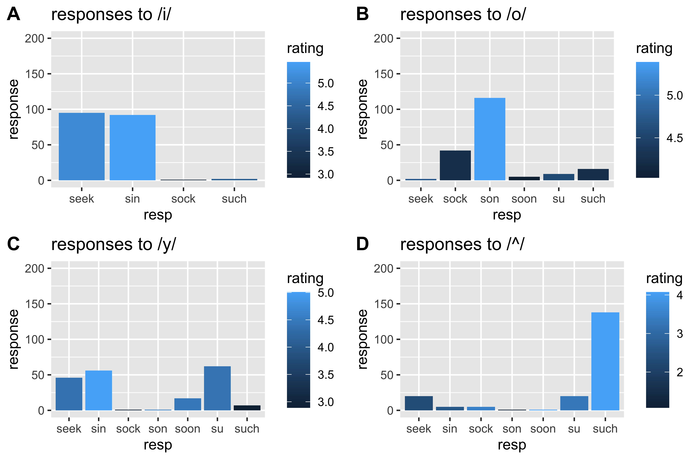
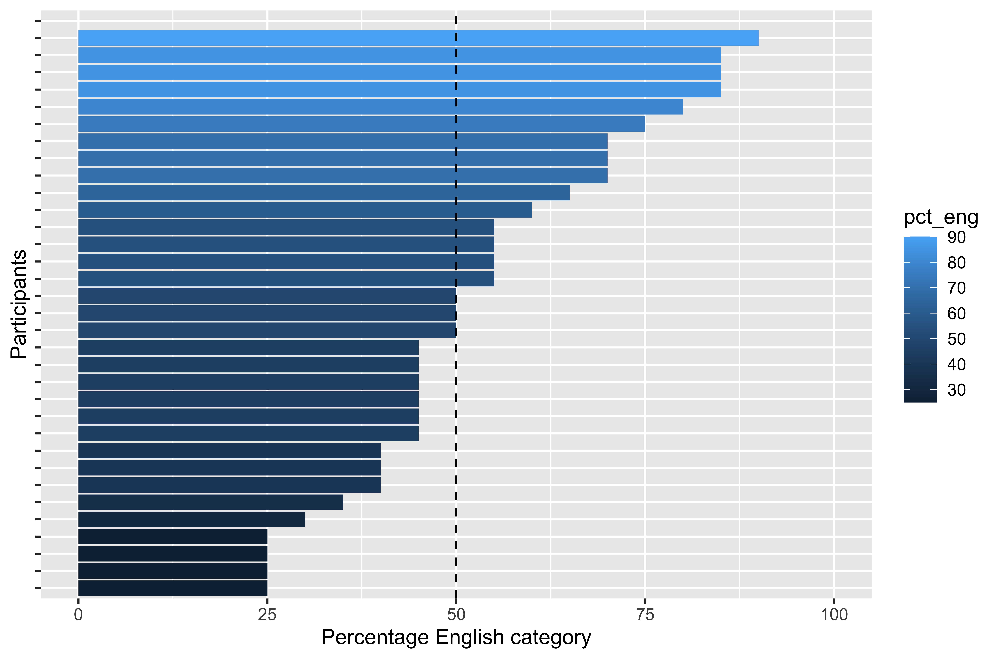

```{r, include=FALSE}
library(tidyverse)
knitr::opts_chunk$set(message = FALSE, warning = FALSE, echo = FALSE, fig.height = 8, fig.width = 14)
```

# Overview

- Quick background 

--

- Method 

--

- Results 

--

- Discussion 

---

# L3 models


--


--


--


---

# L3 Models 

Two major questions: 

--

**Q1: What determines how bilinguals approach a third language?**

--

- Typology?

- Order of acquisition? 

- Abstract properties of specific language structures?

- Input?

- Metalinguistic knowledge?

--

**Q2: How is the sound system of a new language learned?**

---

# Question


--

.big[
How would they pronounce *patte*?
]

--

Why?

---

# Models

Both L3 models and L2 phonology model make predictions in regard to this question.

--

L3 models predict **which language** will impact the L3, if just one. 
 - TPM
 - L2SF
 - LPM
 
L3 models do not make specific predictions related to cross-linguistic influence occurs in third language phonology based on language specific categories. 
 
--

L2 phonology models predict how **cross-linguistic similarity** affects learning new sounds. 
 - PAM

L2 phonology models do not consider multilingual individuals in their predictions, and typically assume a monolingual inventory. 

--

How does crosslinguistic similarity of phonological systems interact with language general factors such as general typology and language status in third language acquisition?   

---

# Quick background

## PAM 

.big[
- The **Perceptual Assimilation Model** (PAM) models the acquisition of L2 sound contrasts.
]

--

.big[
- In L2 acquisition, sounds are thought to be assimilated to L1 categories.
]

--

.big[
- Difficulty in the acquisition of a new language contrast is based on how sounds are contrasted in the L1.
]

---

# Tasks 

.big[
- To test category assimilation, **phoneme categorization tasks** have been carried out. 
]

--

- Participants **hear** an L2 sound 

--

- Participants **pick an L1 category** that best fits the sound

--

- Participants **rate their selection**


---

.big[
- How is learning the sounds of a new language complicated in an L3 setting?
]

- RQ: Do bilinguals have access to both L1 and L2 phonemes (categories) when they perceive L3 sounds? 
]

---

# Method

## Participants

- English L1 - Spanish L2 late bilinguals 

- Recruited on Prolific 

- Living in the northeast US

--

## Task 

- Phoneme categorization task 

---

background-image: url(https://media.giphy.com/media/868ED0fFNYqXxZWeon/giphy.gif)
background-size: 1000px
background-position: 50% 50%

---

# Method

## Materials 

.big[
- 4 Conditions

 - /o/ Spanish bias condition
 - /^/ English bias condition
 - /i/ Both language condition 
 - /y/ Neither language
]

---

# Results 



---

# Results 



---

background-image: url(https://media.giphy.com/media/868ED0fFNYqXxZWeon/giphy.gif)
background-size: 1000px
background-position: 50% 50%

